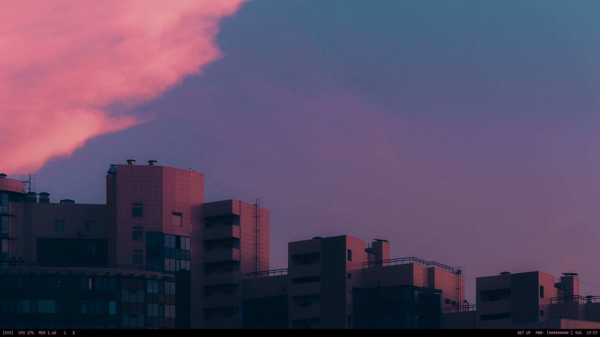
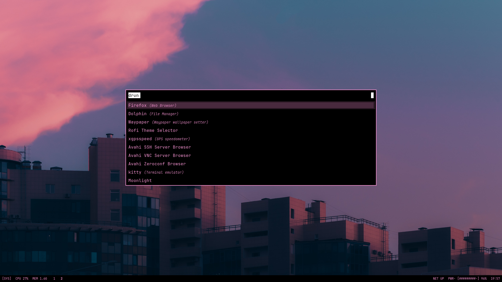
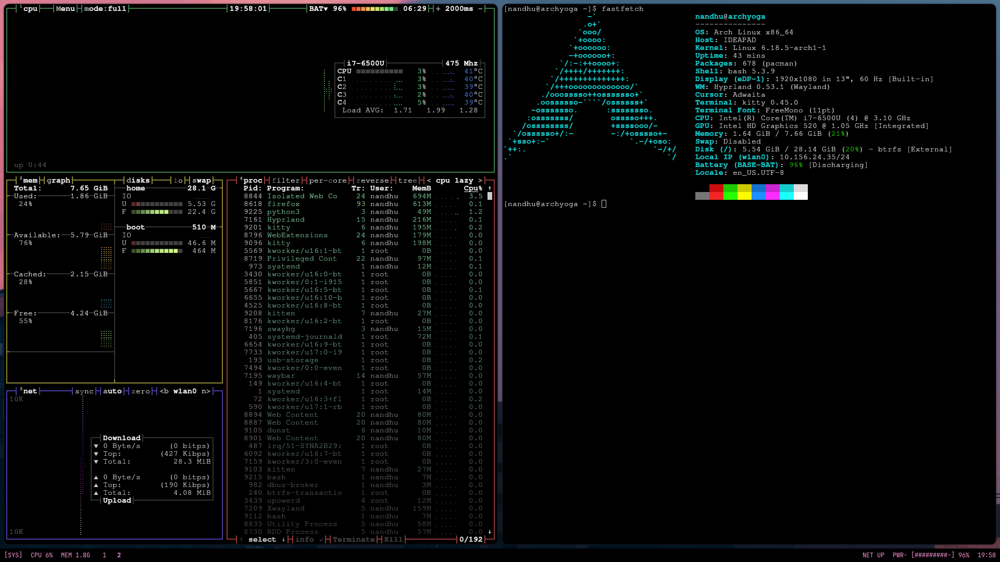

# Hyprland Configuration

A minimal, keyboard-driven **Hyprland** setup focused on clarity, performance, and a terminal-centric workflow.
Designed for laptops, Wayland-native tools, and low visual noise.

This repository contains my personal Hyprland environment including window management, Waybar, terminal tools, and related scripts.

---

## Screenshots

### Desktop


### Application Launcher


### Tiling



* Desktop overview
* Rofi (drun) launcher
* Terminal workflow with system monitoring

---

## Features

* **Hyprland (Wayland compositor)**

  * Dwindle layout
  * Smooth but fast animations
  * Keyboard-first navigation
  * Laptop-friendly defaults

* **Waybar**

  * Text-only, minimal status bar
  * Custom battery indicator (sysfs-based, no UPower dependency)
  * CPU, memory, network, clock
  * Clean monospace styling

* **Rofi**

  * Simple drun launcher
  * No icons, fast filtering
  * Minimal theme

* **Terminal workflow**

  * Kitty terminal
  * Scratchpad terminal (special workspace)
  * tmux + system monitors (optional)

* **Utilities**

  * grim + slurp for screenshots
  * wl-clipboard for Wayland clipboard
  * mako for lightweight notifications (optional)

---

## Key Bindings (Highlights)

| Key                   | Action                      |
| --------------------- | --------------------------- |
| `Super + Enter`       | Toggle floating             |
| `Super + T`           | Open terminal               |
| `Super + Space`       | App launcher (rofi)         |
| `Super + B`           | Open browser                |
| `Super + Q`           | Close window                |
| `Super + Tab`         | Next workspace              |
| `Super + Shift + Tab` | Previous workspace          |
| `Super + ``           | Toggle scratchpad terminal  |
| `Print`               | Screenshot (clipboard)      |
| `Super + Print`       | Area screenshot (clipboard) |

---

## Screenshot Shortcuts

Uses Wayland-native tools:

* `grim` – screenshot backend
* `slurp` – region selection
* `wl-clipboard` – clipboard integration

Screenshots can be copied to clipboard or saved to disk.

---

## Directory Structure

```
.
├── hypr/          # Hyprland configuration
├── waybar/        # Waybar config + styles
│   └── scripts/   # Custom scripts (battery, etc.)
├── kitty/         # Terminal configuration
└── README.md
```

---

## Dependencies

Core:

* `hyprland`
* `waybar`
* `rofi`
* `kitty`

Utilities:

* `grim`
* `slurp`
* `wl-clipboard`
* `brightnessctl`
* `pamixer`

Optional:

* `mako` (notifications)
* `tmux`
* `btop` / `htop`

---

## Battery Indicator

The battery indicator is implemented using a **custom script** that reads directly from:

```
/sys/class/power_supply/
```

This avoids DBus / UPower issues and works reliably across systems (`BAT0`, `BAT1`, etc.).

---

## Installation (Manual)

Clone the repository:

```bash
git clone git@github.com:NandhuKishore-18406/hyprland-config.git
```

Copy configs into place:

```bash
cp -r hypr ~/.config/
cp -r waybar ~/.config/
cp -r kitty ~/.config/
```

Reload Hyprland:

```bash
hyprctl reload
```

---

## Notes

* This setup is intentionally **minimal**.
* No desktop effects beyond what improves usability.
* No hard dependency on portals or heavy services.
* Meant to be readable, modifiable, and stable.

---

## License

Personal configuration.
Use, modify, and adapt as you like.
